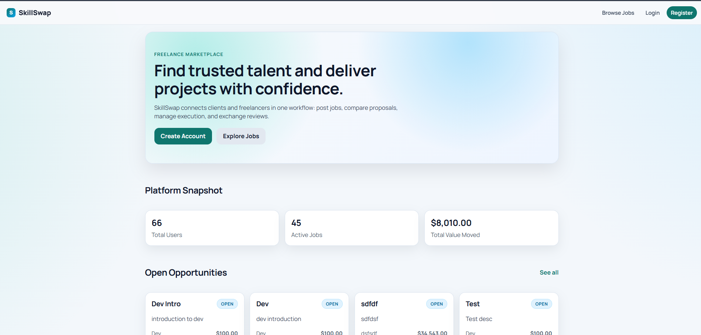
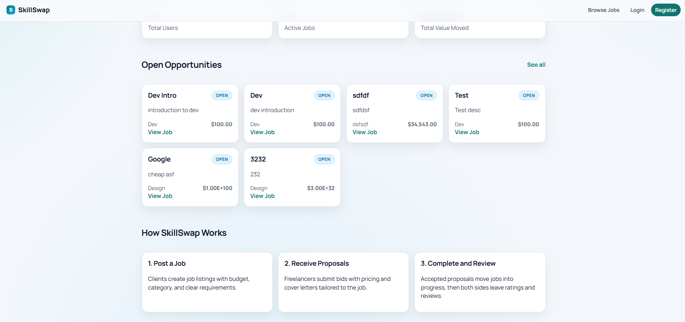
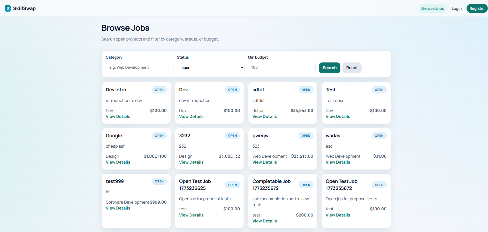
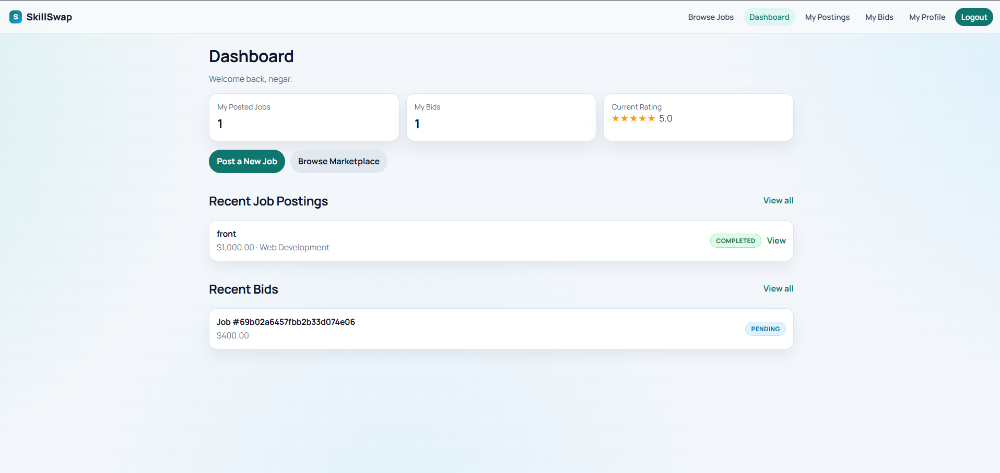
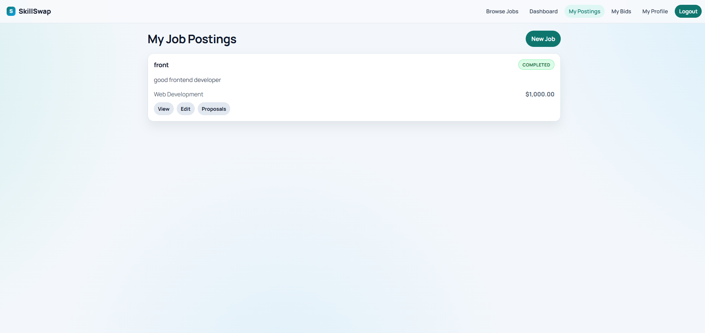

# SkillSwap - Freelance Marketplace Platform

SkillSwap is a **freelance marketplace web application** built with Angular that integrates with a real REST API to simulate a complete freelance job marketplace workflow.

Users can create accounts, post jobs, submit proposals, hire freelancers, complete work, and review participants. The project demonstrates **API-driven frontend development, authentication flows, and scalable Angular architecture**.

The application is designed to mimic the core functionality of platforms like **Upwork or Fiverr**, focusing on the interaction between the frontend client and backend services.

---
## Live Demo

🌐 **Live Link:** [Skiil Swap](skillswap-negar.vercel.app)

---

# Screenshots

### Main Page



### Main Page – Statistics and Job Preview



### Jobs Marketplace



### User Dashboard



### User Postings



---

# Key Capabilities

### Full Marketplace Workflow

SkillSwap implements the complete lifecycle of freelance work:

```
Job Creation → Proposal Submission → Hiring → Work Completion → Reviews
```

The application supports both **clients** and **freelancers**, allowing users to interact with the platform from different roles.

---

### Authentication & Secure API Communication

Authentication is handled using **JWT tokens**.

Features include:

* user registration and login
* secure API requests with automatic token injection
* authentication guards for protected routes
* automatic redirect on authentication failures

Angular **HTTP interceptors** attach tokens to all authenticated requests.

---

### Job Marketplace

Users can explore and interact with freelance job listings.

Supported features include:

* browsing available jobs
* filtering job listings
* viewing job details
* creating new job postings
* editing job information
* managing personal job listings

---

### Proposal System

Freelancers can submit proposals for jobs posted by clients.

Capabilities include:

* submitting proposals
* viewing submitted proposals
* withdrawing pending proposals
* accepting a proposal as a job owner

Once a proposal is accepted, the job transitions to the next stage of the workflow.

---

### Job Lifecycle Management

Jobs progress through defined states:

```
open → in_progress → completed
```

This lifecycle ensures that the system maintains clear job status tracking.

---

### Review and Rating System

After job completion:

* both participants can leave reviews
* ratings range from **1–5**
* user ratings update automatically based on completed work

This mirrors the reputation systems used in real freelance marketplaces.

---

# Tech Stack

### Frontend

* Angular
* TypeScript
* SCSS
* Angular Router
* Reactive Forms
* RxJS
* HTTP Interceptors

### Backend API

The frontend integrates with a provided REST API:

```
https://stingray-app-wxhhn.ondigitalocean.app
```

Authentication is performed using:

```
Authorization: Bearer <JWT_TOKEN>
```

All business data is fetched from this backend API.

---

# Architecture

The application uses a **feature-based Angular architecture** to maintain modularity and scalability.

```
src/app
 ├── core
 │   ├── config
 │   ├── guards
 │   ├── interceptors
 │   ├── models
 │   ├── services
 │   └── utils
 │
 ├── shared
 │   └── components
 │
 ├── features
 │   ├── auth
 │   ├── dashboard
 │   ├── jobs
 │   ├── proposals
 │   ├── platform
 │   └── users
 │
 └── layout
```

This structure enables:

* separation of concerns
* reusable UI components
* maintainable feature modules
* scalable application growth

---

# Error Handling

The frontend gracefully handles API errors returned by the backend.

Handled responses include:

* 400 – Bad Request
* 401 – Unauthorized
* 403 – Forbidden
* 404 – Not Found
* 409 – Conflict

Errors are surfaced through clear UI feedback to the user.

---

# Form Validation

All forms use Angular **Reactive Forms** for strong validation and state management.

Examples include:

* required field validation
* email format validation
* password constraints
* numeric validation for budgets
* rating limits (1–5)
* proposal price validation

---

# Running the Project

### Clone the repository

```
git clone https://github.com/negarprh/SkillSwap.git
cd SkillSwap
```

### Install dependencies

```
npm install
```

### Start the development server

```
ng serve
```

The application will run at:

```
http://localhost:4200
```

---
